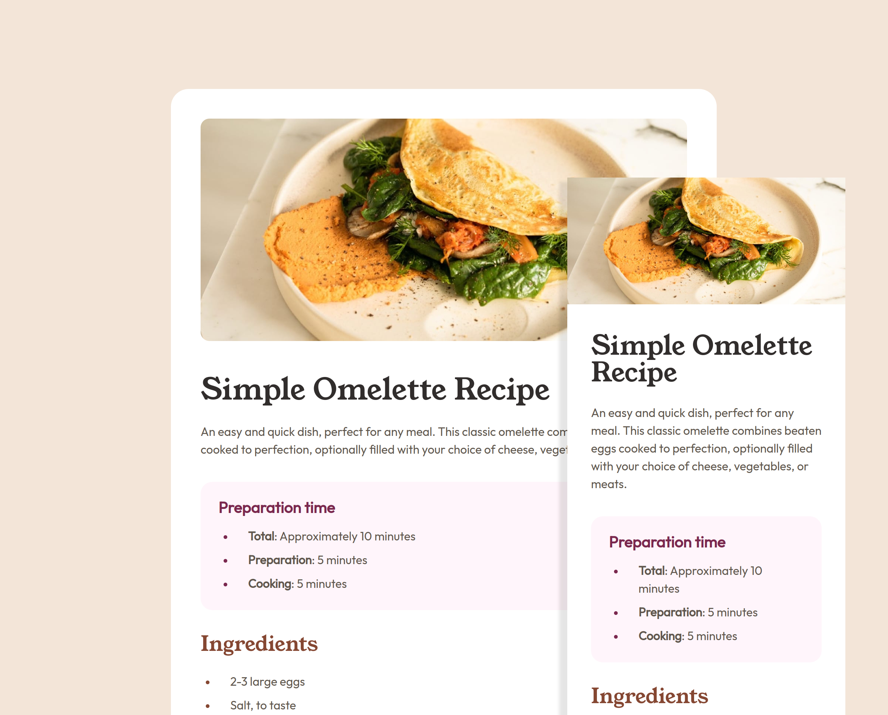

# Frontend Mentor - Recipe page solution

This is a solution to the [Recipe page challenge on Frontend Mentor](https://www.frontendmentor.io/challenges/recipe-page-KiTsR8QQKm). Frontend Mentor challenges help you improve your coding skills by building realistic projects. 

## Overview

### Screenshot



### Links

- [Solution on FrontendMentor](https://www.frontendmentor.io/solutions/recipe-page-using-semantic-html-egsvPw6Drv)
- [Live Example on Vercel](https://recipe-page-ten-alpha.vercel.app/)

## My process

If you overlay the design images onto the final layout for both mobile and desktop, you wouldn't notice much difference in terms of spacing and sizing, which was exactly what I aimed for.

Following achieving pixel-perfect precision, my next objective was to utilize as much semantic HTML as possible. I accomplished this by incorporating tags such as `<header>`, `<article>`, `<section>`, and `<footer>`, which provide numerous built-in benefits, including improved accessibility.

### Built with

- Mobile-first workflow (Progressive development)
- Semantic HTML5 markup
- CSS custom properties

### What I learned

I tried to manage most of the CSS values in this project with custom properties for easier sizing as well as color customizations. 

One thing where I kind of improved a bit is managing colors sensibly. Instead of naming them literally, I tried arranging them as primary, secondary, and accent values which also looks better design-wise.

```css
:root {
  --color-primary-white: hsl(0 0% 100%);
  --color-primary-eggshell: hsl(30 54% 90%);

  --color-secondary-rose-white: hsl(330 100% 98%);
  --color-secondary-light-grey: hsl(30 18% 87%);
  --color-secondary-dark-charcoal: hsl(24 5% 18%);
  --color-secondary-wenge-brown: hsl(30 10% 34%);

  --color-accent-nutmeg: hsl(14 45% 36%);
  --color-accent-dark-raspberry: hsl(332 51% 32%);
}
```

### Continued development

I'd like to extend the color scheme management part to other projects and improve the implementation of color palettes using CSS custom properties and the HSL color model.

Following that, I may also revisit this project later to incorporate additional features, such as a dark mode.

## Author

- GitHub / [c99rahul](https://github.com/c99rahul)
- FrontendMentor / [@c99rahul](https://www.frontendmentor.io/profile/c99rahul)
- Twitter / [@c99rahul](https://twitter.com/c99rahul)